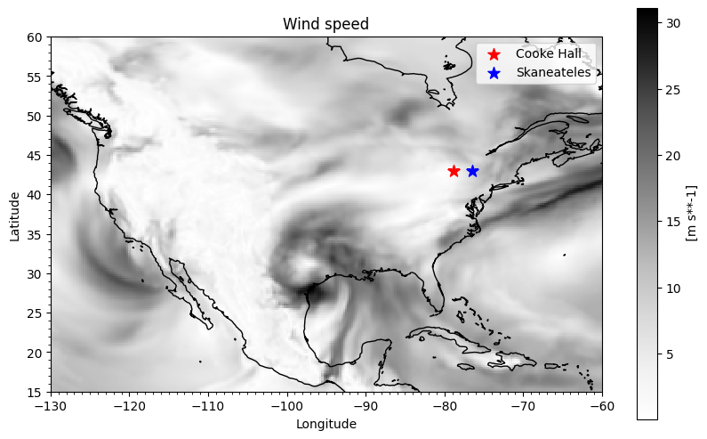
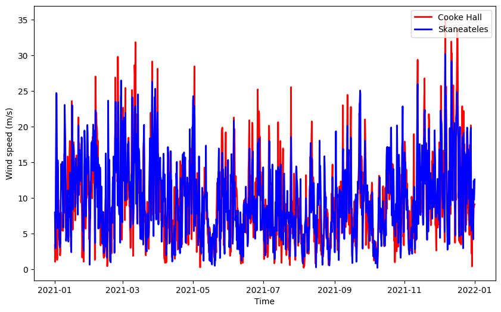

# learning-to-work-with-netcdfs
Learn how to work with multidimensional climate data (netcdfs) by processing and making simple plots with ERA5 hourly single-level reanalysis data.

In this code, you'll learn how to make plots like this:  

