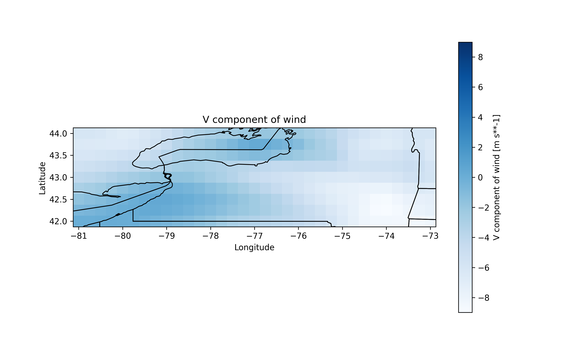
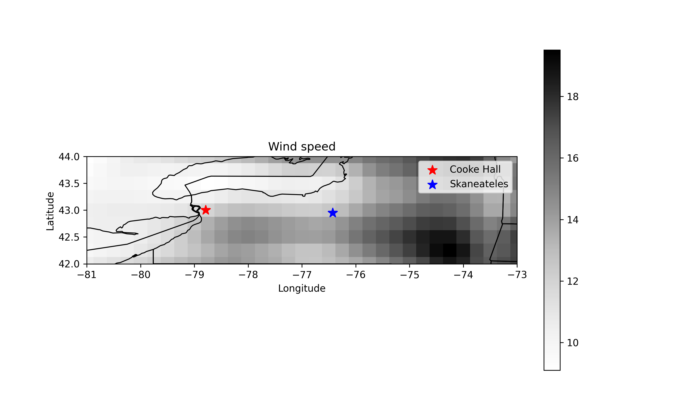
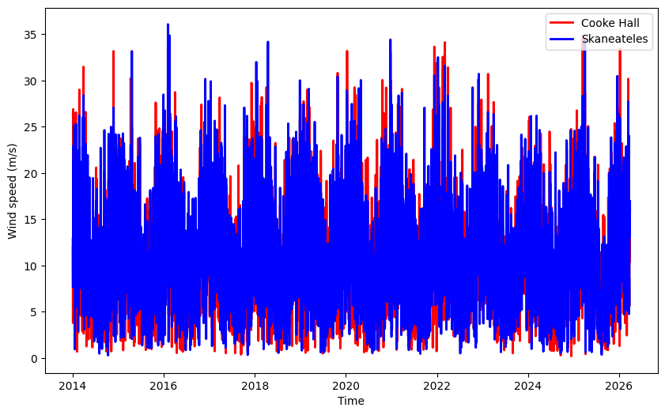

# Learning to work with netCDFs
Learn how to work with multidimensional climate data (netcdfs) by processing and making simple plots with ERA5 hourly single-level reanalysis data.

To use this code, download the Python script `process-era5-netcdfs.ipynb` and the `datasets` folder. Then, run the Python script in Google Colab, VS Code, or another Python program.

In this code, you'll learn how to make plots like this:  

